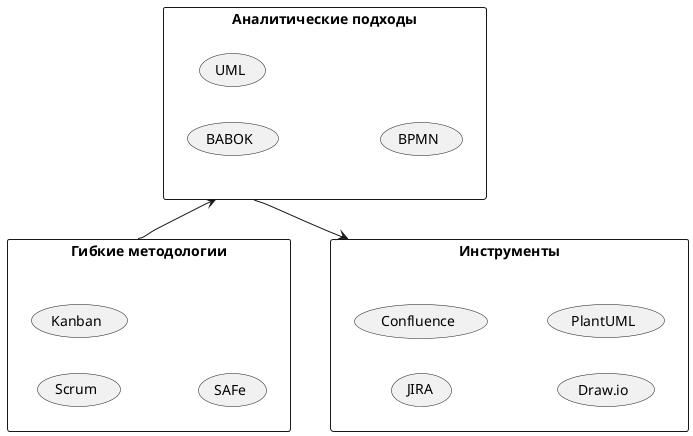

# Профиль системного аналитика

## 📋 Общая информация
**Должность:** Системный аналитик  
**Отдел:** Разработки / Бизнес-анализа  
**Уровень:** [Senior/Middle/Junior]  
**Дата найма:** [дата]

## 🎯 Основные обязанности

### Анализ требований
- Выявление и формализация бизнес-требований заказчика
- Проведение интервью с стейкхолдерами
- Анализ и документирование функциональных и нефункциональных требований
- Приоритизация требований (MoSCoW, RICE)

### Проектирование решений
- Разработка моделей бизнес-процессов (BPMN)
- Создание спецификаций API
- Проектирование архитектуры решений
- Разработка пользовательских сценариев (User Stories, Use Cases)

### Документирование
- Подготовка технических заданий (ТЗ)
- Ведение бэклога продукта
- Составление руководств пользователя
- Подготовка отчетной документации

## 🛠 Технический стек

### Методологии
